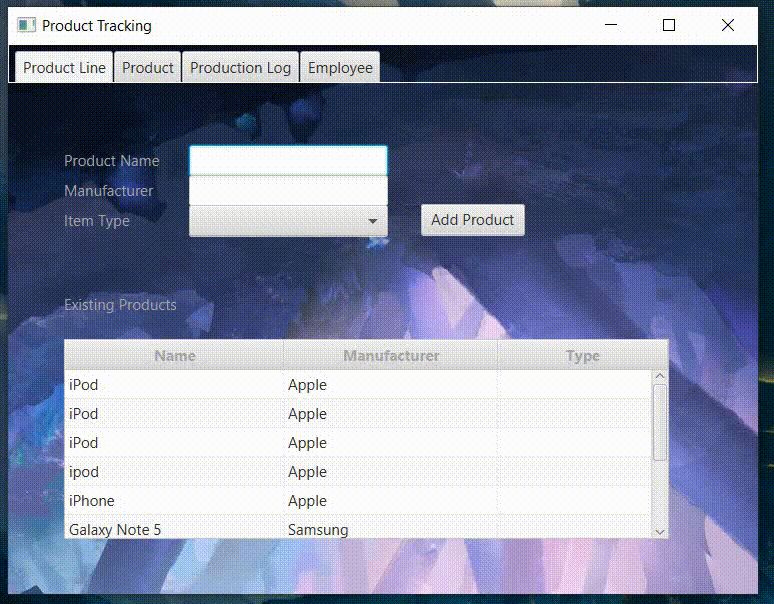
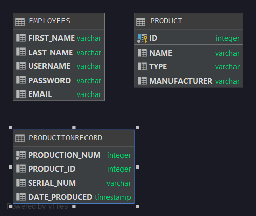

# Project Title
This project is designed to track the production of audio, visual and combination products.
It was made for my Object-Oriented Programming class, created independently but with guided instrutions
and help from Professors, TAs, and other classmates. At the time of the creation of this project
I was a novice with Java but as the semester went along, I learned more complicated Java concepts.

## Demonstration

## Documentation
[JavaDoc](index.html)

## Diagrams

## Built With
- Intellij IDE
-Scenebuilder 2.0
- H2 Database

## Contributing
I recieved a lot of help from my professor Scott Vanselow and my TA Damien.
I also got some help from these websites:
-https://sites.google.com/site/profvanselow/course/cop-3003/bike-project?authuser=0
-https://examples.javacodegeeks.com/core-java/util/regex/matcher/validate-password-with-java-regular-expression-example/
-https://www.geeksforgeeks.org/regular-expressions-in-java/

## Author
- Elizabeth Gonzalez
## License
This project is licensed under the MIT License.

## Acknowledgments
I recieved a lot of help from my Professor Scott Vanselow and my TA Damien.
I also got some help from these websites:
-https://sites.google.com/site/profvanselow/course/cop-3003/bike-project?authuser=0
-https://examples.javacodegeeks.com/core-java/util/regex/matcher/validate-password-with-java-regular-expression-example/
-https://www.geeksforgeeks.org/regular-expressions-in-java/

And from my classmates: Kevin Mak and Louis Sze

## Key Programming Concepts Utilized
Java(OOP)
- creating objects
- polymorphism and inheritance
- working with Abstract, Enums and Interfaces

SQL Database: H2
- creating tables
- inserting and updating tables
- selecting information to populate scenes
